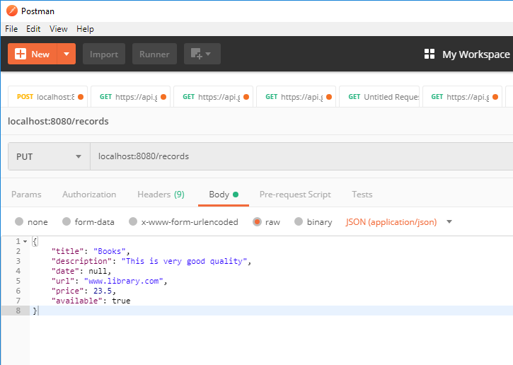
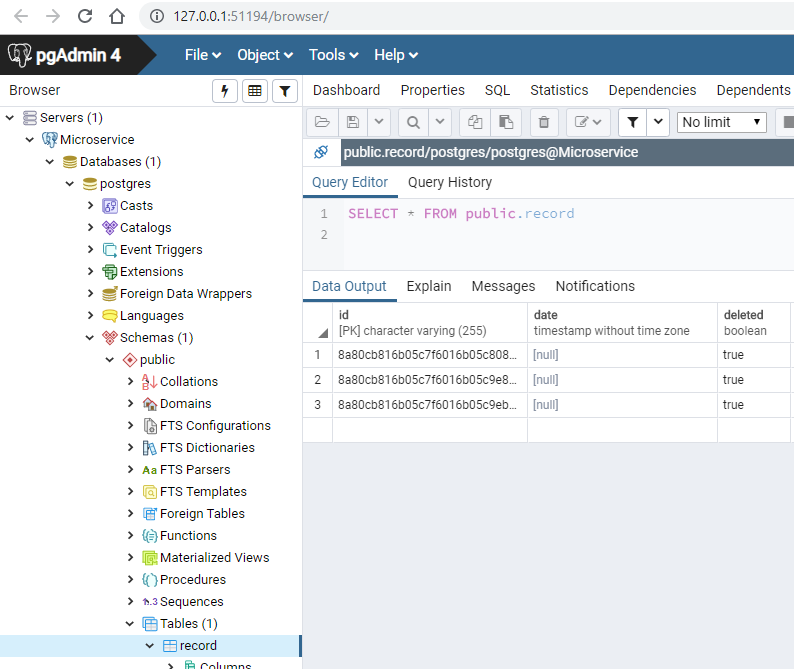

## This is simple microservice. Made just for fun

### Install 'CMD support' plugin for Intellij IDEA:

https://plugins.jetbrains.com/plugin/5834-cmd-support
`File -> Settings -> Plugins -> CMD support -> Install`

it will make easier launching app in *Docker* directly from *IDEA*
by mouse right-click on *run.cmd* -> *launch cmd script*

### Launch postgres database in docker using run.cmd script

### Install PgAdmin (I used 4.6)

### Connect to database using PgAdmin

`Name : Microservice`
`Host : localhost`
`Port : 5432`
`Maintenance database : postgres`
`Username : postgres`
`Password : docker`
Don't forget to set checkbox 'Save password'

 

Verify that connection was successful

### Add example record:

`PUT localhost:8080/records`
`BODY:`
`{`
    `"title": "Books",`
    `"description": "This is very good quality",`
    `"date": null,`
    `"url": "www.library.com",`
    `"price": 23.5,`
    `"available": true`
`}`

don't forget about json headers

### REST API is available by URL:

http://localhost:8080/swagger-ui.html

